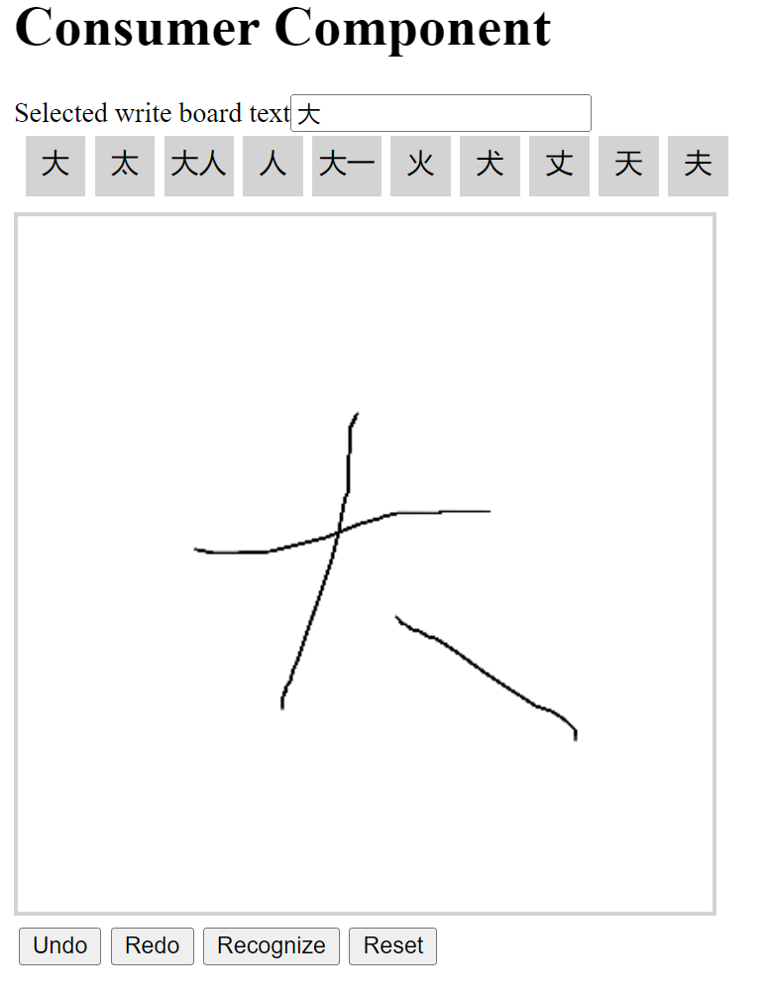

# NgWriteBoard

An Angular component to capture user mouse input and recgonize charactor. User can select word for testing.



## Setup

1. Install npm package.

   In your angular project, run command to install component.
   ```batch
   npm install ng-write-board
   ```
2. Register in module.

   In `app.module.ts`, add code below to import module.
   ```typescript
   import { NgModule } from '@angular/core';
   import { BrowserModule } from '@angular/platform-browser';
   import { NgWriteboardModule } from 'ng-write-board';
   import { AppComponent } from './app.component';

   @NgModule({
   declarations: [
       AppComponent
   ],
   imports: [
       BrowserModule,
       NgWriteboardModule
   ],
   providers: [],
   bootstrap: [AppComponent]
   })
   export class AppModule { }
   ```
3. Add in component.
   In target component HTML, add related HTML code and related event. Sample as below.
   ```html
   <lib-writeboard id="writeboard" 
       on-textSelected="writeboardTextSelected($event)">
       </lib-writeboard>
   ```
   In target component typescript, add method to capture event. Sample as below.
   ```typescript
   writeboardTextSelected(value: string) {
    const textBox = document.getElementById("writeboardTextBox") as HTMLInputElement || undefined || null;
    textBox!.value+=value;
   }
   ```

## Development

This project was wrote with [Angular CLI](https://github.com/angular/angular-cli) version 13.3.4.

Run `ng build --watch` for local development. In other comsumer project, run `npm install 'file://{path-to-repo}//dist//ng-write-board'`

### Running unit tests

Run `ng test` to execute the unit tests via [Karma](https://karma-runner.github.io). It will generate coverage report as well.

### Running end-to-end tests

Run `ng e2e` to execute the end-to-end tests via a platform of your choice. To use this command, you need to first add a package that implements end-to-end testing capabilities.
